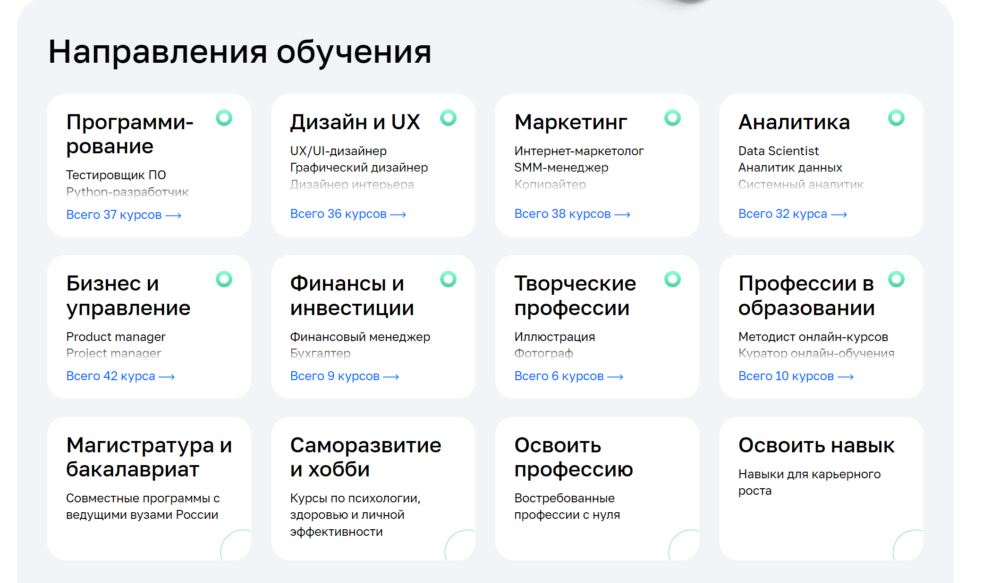
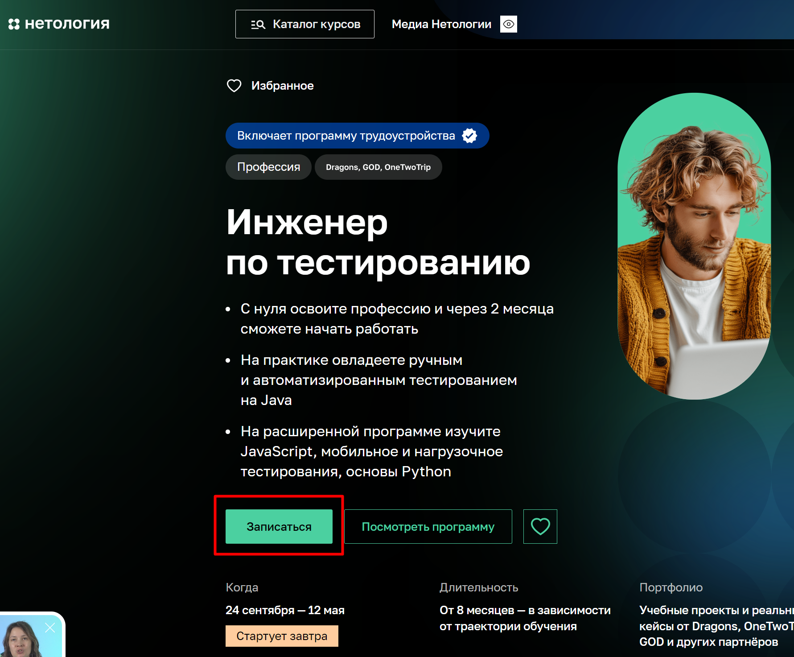
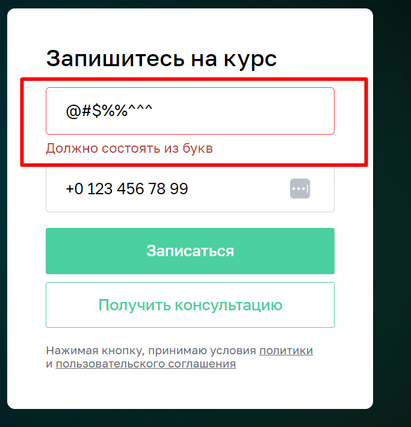
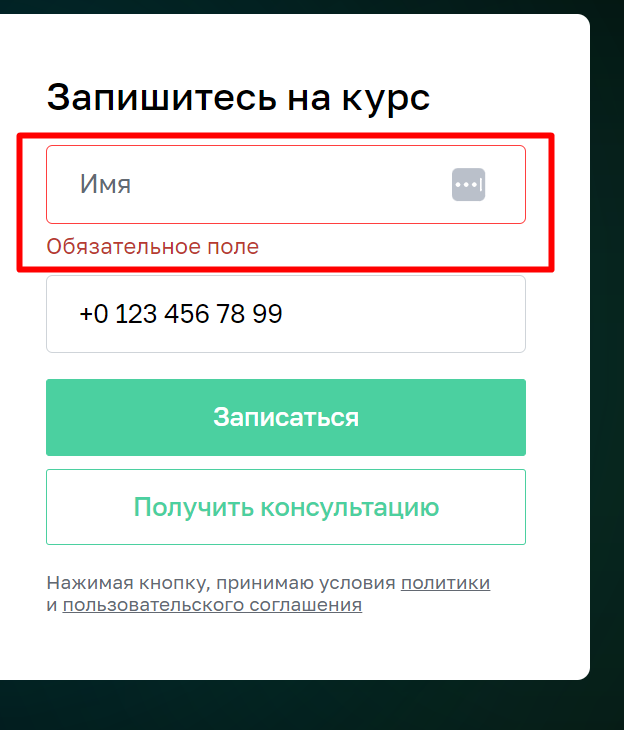
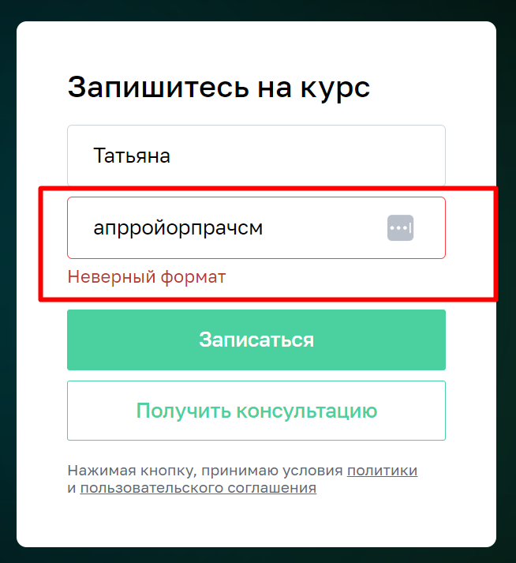
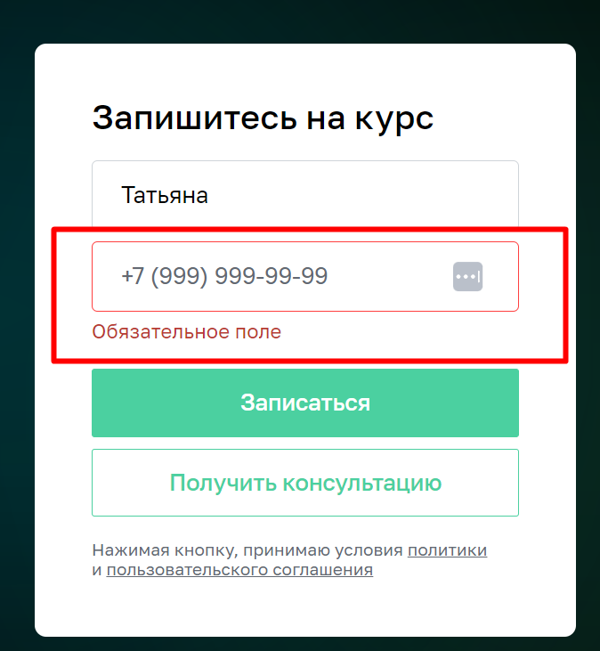

<<<<<<< HEAD
# **План автоматизации тестирования сценария перехода к форме записи и заполнения формы _записи на обучение «Инженер по тестированию»_**
------------------------------
## 1. [Перечень автоматизированных сценариев](#перечень-автоматизированных-сценариев)
## 2. [Перечень используемых инструментов с обоснованием выбора](#перечень-используемых-инструментов-с-обоснованием-выбора)
## 3. [Перечень необходимых разрешений, данных и доступов](#перечень-необходимых-разрешений,-данных-и-доступов)
## 4. [Перечень и описание возможных рисков при автоматизации](#перечень-и-описание-возможных-рисков-при-автоматизации)
## 5. [Перечень необходимых специалистов для автоматизации](#перечень-необходимых-специалистов-для-автоматизации)
## 6. [Интервальная оценка с учётом рисков в часах](#интервальная-оценка-с-учётом-рисков-в-часах)

## 1. Перечень автоматизированных сценариев 

1. [Переход к форме записи №1](#переход-к-форме-записи-№1)
2. [Переход к форме записи №2](#переход-к-форме-записи-№2)
3. [Заполнение и отправка формы (валидные данные)](#заполнение-формы-и-отправка-формы-валидные-данные)
4. [Заполнение и отправка формы (невалидные данные)](#заполнение-и-отправка-формы-невалидные-данные)

## 1.Переход к форме записи №1 
##### Шаги
1. Открыть сайт [netology.ru](https://netology.ru/)
2. Проскролить страницу до раздела "Направления обучения"
    

3. Кликнуть раздел "Программирование"
4. На открывшейся странице найти раздел **Инженер по тестированию** , кликнуть

5. На открывшейся странице проскролить до формы записи на курс

**Ожидаемый результат:** открывается страница с формой записи на курс

### 2. Переход к форме записи №2 

1. Открыть сайт [netology.ru](https://netology.ru/)
2. На странице сайта найти кнопку **каталог курсов**, кликнуть
3. В открывшемся списке кликнуть на кнопку **программирование**
5. В поисковой строке ввести **Инженер по тестированию**
6. Кликнуть кнопку **Найти курс**
7. Выбрать в найденных запросах курс **Инженер по тестированию**
8. На открывшейся странице кликнуть кнопку **Записаться**

**Ожидаемый результат:** открывается страница с формой записи на курс

### 3. Заполнение формы и отправка формы валидными данными 

1. В поле **имя** ввести значения например **Татьяна**
2. В поле **номер телефона** ввести значения например **+0 123 456 78 99**
3. Нажать кнопку записаться

**Ожидаемый результат:** форма отправлена, появляется сообщение  "Запись на курс успешно создана. С Вами свяжется наш специалист".

### 4. Заполнение и отправка формы не валидными данными 
#### _Кейс №1_
1. В поле **имя** ввести спецсимволы.
2. В поле **номер телефона** ввести значение, например **+0 123 456 78 99**.
3. Нажать кнопку записаться.

**Ожидаемый результат**: форма не отправлена, поле имя подсвечивается красным, появляется подпись **Должно состоять из букв**

#### _Кейс №2_

1. Поле **имя** оставить пустым.
2. В поле **номер телефона** ввести значение, например **+0 123 456 78 99**.
3. Нажать кнопку записаться.

**Ожидаемый результат**: форма не отправлена, поле имя подсвечивается красным, появляется подпись  **Обязательное поле**

#### _Кейс №3_

1. Поле **имя** ввести значение, например **Татьяна**
2. В поле **номер телефона** ввести буквы
3. Нажать кнопку записаться

**Ожидаемый результат:** форма не отправлена, поле телефон подсвечивается красным, появляется подпись **Неверный формат**

#### _Кейс №4_

1. Поле **имя** ввести значение, например **Татьяна**
2. В поле **номер телефона** оставить поле пустым
3. Нажать кнопку записаться

**Ожидаемый результат:** форма не отправлена, поле телефон подсвечивается красным, появляется подпись **Обязательное поле**

## 2. Перечень используемых инструментов с обоснованием выбора 

### _JUnit5_
- Используется для написания тестов, JUnit 5 предлагает большую детализацию, что упрощает работу, особенно при использовании систем сборки Maven и Gradle.

### _Allure Report_
- Подробный анализ теста : Allure Report предоставляет комплексный анализ выполнения теста, включая этапы теста, время начала, продолжительность и статус. Этот уровень детализации позволяет точно понять, что происходило во время каждого теста, что упрощает выявление любых проблем или областей для улучшения.

### _Gradle_
- инструмент для автоматизации сборки, известный своей гибкостью в сборке программного обеспечения. Процесс становится более последовательным с помощью инструментов автоматизации сборки.

### _Selenide_
- Оболочка вокруг Selenium WebDriver, упрощает процесс написания автоматизированных тестов .
- Обеспечивает более краткий и читаемый синтаксис, сокращая шаблонный код и решая многие распространенные проблемы «из коробки», такие как ожидание появления элементов или их активации.

### 3. Перечень необходимых разрешений, данных и доступов 

- Разрешение на тестирование
- Доступ к тестовому окружению
- Тестовые данные

### 4. Перечень и описание возможных рисков при автоматизации 

- Ошибки сервера.
- Ошибки при интеграции с внешними системами.
- Изменения в интерфейсе.
- Проблемы с производительностью из-за большой нагрузки.

### 5. Перечень необходимых специалистов для автоматизации 

- QA Automation engineer

### 6. Интервальная оценка с учётом рисков в часах 

- Написание кода автоматизированных сценариев - 12 часов
- Время на форс-мажорные ситуации - 5 часов
- Подготовка отчетности и документации - 8 часов
- ВСЕГО - 25 часов

<<<<<<< HEAD

